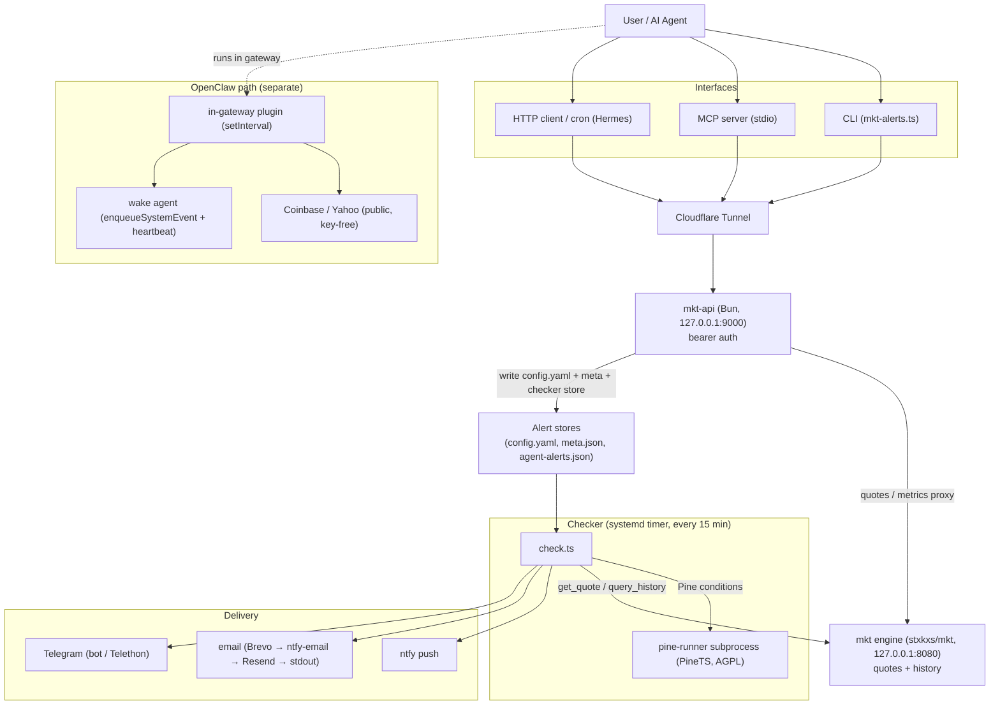

# mkt-alerts — Product Requirements Document

## 1. Overview

mkt-alerts is a self-hostable market-alert engine plus delivery layer. It lets humans and AI agents set price, indicator, and Pine Script v5 alerts on stocks and crypto, then pushes a notification when a condition fires.

It wraps a third-party price engine ([github.com/stxkxs/mkt](https://github.com/stxkxs/mkt)) and adds:

- Bearer-token auth
- Alert storage (mkt `config.yaml` + a sidecar meta store + a checker mirror store)
- A checker that evaluates conditions every 15 minutes
- Multi-channel delivery (ntfy, email, Telegram, stdout)
- An HTTP API
- A CLI
- An MCP server (own read/write server)
- An OpenClaw agent-wake plugin

License: MIT. The Pine Script sidecar (PineTS) is AGPL-3.0 and is kept out-of-process (spawned as a subprocess, never bundled into the MIT CLI/npm package).

## 2. Target users

| User | Need |
|---|---|
| AI trading/research agents | Arm an alert after analysis, get woken when a level hits, act on it |
| Self-hosting technical traders | TradingView-style alerts without TradingView alert-plan quotas |
| Developers | Embed market alerts into their own agents/backends via CLI/API/MCP |

## 3. Problem / why

TradingView alerts are:

- Capped by plan tier
- Run only on TradingView servers
- Not programmatically drivable by an agent
- Unable to evaluate arbitrary custom Pine on your own schedule off-platform

mkt-alerts replaces that:

- Unlimited self-hosted alerts (no per-alert/per-check paywall)
- Agent-drivable via CLI, HTTP API, and MCP
- Custom Pine Script v5 run off-TradingView via an isolated PineTS sidecar

Scope note: mkt-alerts is an alerting tool only — not charts, screener, or analysis. Comparisons are against TradingView *alerting*, not the full product.

## 4. Use cases

- Replace TradingView price / RSI / MACD / SMA alerts with self-hosted equivalents.
- An analysis agent sets an entry-level alert after a dip analysis, then is woken (OpenClaw plugin) to act when price reaches the level.
- Scheduled re-checks driven by an external scheduler (e.g. Hermes cron) calling the same CLI/API.
- A Pine golden-cross alert delivered to Telegram, email, or ntfy.

## 5. Interfaces

| Interface | Purpose | Status |
|---|---|---|
| CLI (`mkt-alerts.ts`) | `add` / `list` / `remove` / `subscribe` / `try` / `mcp` | Implemented |
| MCP server (own) | `list_alerts`, `add_alert`, `remove_alert` over stdio JSON-RPC 2.0 | Implemented |
| Third-party `mkt mcp` | Read-only quote/history source used by the checker | Implemented (read-only) |
| HTTP API (`scripts/api.ts`) | Bearer-gated REST in front of mkt | Implemented |
| OpenClaw plugin | In-gateway checker that wakes the agent on fire | Implemented |
| Hermes / cron | External scheduler calling the same CLI/API | Supported (uses existing interfaces) |
| Interactive Telegram bot interface | Two-way control via a Telegram bot | **Planned, not implemented** |
| Slack app | Slack interface | **Planned, not implemented** |

Note: delivery *to* Telegram exists (see §7). An *interactive* Telegram bot interface and a Slack app do not.

The MCP server starts and answers `initialize` / `tools/list` without `auth.json`; auth is loaded lazily only on a tool call. `add_alert` enforces the same `data_source` evidence gate as the CLI.

## 6. Alert conditions

| Condition | Status | Notes |
|---|---|---|
| `above` / `below` | Fires | Price crosses threshold. **Requires `--data-source`** |
| `pct_up` / `pct_down` | Fires | Price moves X% vs prior change |
| `rsi_above` / `rsi_below` | Fires | RSI period fixed at 14 |
| `sma_cross_above` / `sma_cross_below` | Fires | SMA period fixed at 20 |
| `macd_cross` | Fires | MACD histogram flips sign |
| `pine` | Fires | Server-side PineTS via `--pine <file>` |
| `volume_above` | **Planned / stub** | Accepted by API/CLI, always evaluates no-fire |
| `stddev_above` | **Planned / stub** | Accepted by API/CLI, always evaluates no-fire |

Compound alerts: repeat `--condition`/`--value`. Match modes `all` / `any` supported by the checker; `sequence` is aliased to `all` (proper ordering planned — needs cross-run state). The CLI itself only emits `all` compounds (no `--match any` flag).

Period limitation: built-in RSI (14) and SMA (20) periods are fixed. For any other period or custom indicator, use a Pine Script alert or a computed price level.

## 7. Push notifications / delivery

Channels verified in `scripts/check.ts`:

| Channel | Spec | Requirement |
|---|---|---|
| stdout | `stdout` | none (logs only) |
| ntfy (default) | `ntfy:<topic>` | none — subscribe on phone |
| Telegram bot | `telegram-bot:<chat>` | `TELEGRAM_BOT_TOKEN` |
| Telegram (Telethon) | `telegram:<target>` | Telethon session on the checker host |
| email | `email:<addr>` | see transport chain below |

Email transport chain (tried in order, first success stops):

```
Brevo (BREVO_API_KEY + ALERT_EMAIL_FROM)
  → ntfy-native email (NTFY_TOPIC + Email: header, NTFY_TOKEN)
  → Resend (RESEND_API_KEY + ALERT_EMAIL_FROM)
  → stdout (never silently dropped)
```

`ALERT_EMAIL_FROM` must be a sender validated in the ESP account; if unset, Brevo and Resend are skipped.

Silent-failure caveat: a 2xx from the mail provider counts as "fired" even if the message is later dropped (e.g. an unvalidated sender). A fired alert does not prove an email arrived — verify the first delivery in the inbox / provider event log before trusting the channel.

## 8. Auth / secrets

Bearer-token model.

- CLI and agents read `~/.config/mkt-watch/auth.json` = `{ apiUrl, token }`.
- Every HTTP call sends `Authorization: Bearer <token>`.
- The server returns `401` without a valid token.
- The token is generated on deploy via `openssl rand -hex 32` and stored in `auth.json` with mode 600 (not committed).
- Underlying secrets (`API_TOKEN`, `BREVO_API_KEY`, tokens, etc.) live in Bitwarden `dev` and are shipped to the VM by `deploy.sh` into `/etc/mkt-daemon.env` (mode 600).

Data-source evidence gate: `above`/`below` alerts require `--data-source` (CLI) or `data_source` (MCP). Without it the alert is refused. This is an anti-fabrication guardrail against invented support/resistance levels. Indicator conditions (rsi, macd, etc.) and Pine alerts are exempt.

## 9. Non-goals

- Not a charting tool.
- Not a TradingView replacement for visualization/screening.
- Not a managed multi-tenant SaaS. The hosted `mkt.agentlabs.cc` is a private, bearer-gated instance, not an open demo.
- The MCP server does not create alerts on the third-party mkt read-only server — writes go through the mkt-alerts HTTP API only.

## 10. Services

Hosted topology: Cloudflare Tunnel → mkt-api (Bun, `127.0.0.1:9000`, bearer auth) → mkt daemon (`127.0.0.1:8080`). The checker runs as a systemd timer (`mkt-check.timer`, `OnCalendar=*:0/15`) and spawns the pine-runner subprocess for Pine alerts. Runs on a GCP e2-micro. The OpenClaw plugin is a separate path: it runs in-gateway, fetches Coinbase/Yahoo directly, and wakes the agent — it never touches `mkt.agentlabs.cc`.



## 11. TDD / test plan

Test-first strategy. Every behavior below is covered by a Bun test that exists today; a new condition, channel, or gate ships with its test written first. Pure functions (`evalCond`, `evaluateJob`, `buildAlertMessage`, transports with injectable `fetchImpl`) are the unit-test surface; the API + checker + Pine paths are integration-tested against temp stores and mocked fetch — no live network, no real emails.

Suite: 5 files, 79 tests, 0 fail (`bun test`). Build: `bun build` bundles clean.

| Area | File | What is asserted |
|---|---|---|
| Condition evaluation | `scripts/check.test.ts`, `scripts/store.test.ts` | Pine conditions fire on true signal, no-fire on false, missing signal defaults no-fire (fail-safe); custom `signalPlot` surfaces in detail; store rejects a pine condition with no/blank script |
| Message building | `scripts/check.test.ts` | Subject = symbol + condition; body carries reason/current/trigger; compound conditions join with `AND` |
| Delivery channels | `scripts/check.test.ts` | Brevo primary over ntfy+Resend; Brevo skipped when `ALERT_EMAIL_FROM` unset; ntfy-native email path; Resend fallback; multi-channel dispatch; all-fail → stdout, no throw; `asciiHeader` strips emoji the ntfy `Title` header can't carry; non-2xx ntfy throws |
| Email fall-through | `scripts/check.test.ts`, `scripts/dividend_watch.test.ts` | Brevo 201 stops chain; 400 / thrown fetch falls through to ntfy-email; all-fail → stdout, never throws |
| Auth / 401 | `scripts/api_mirror.test.ts` | Bearer-gated writes; store-mirror persistence failure returns 500 (not a false 201); channel validation rejects bare `ntfy:`/`email:` with 400, accepts bare `stdout` |
| Data-source gate | `scripts/mcp.test.ts` | `above` without `data_source` rejected (hard gate); `above` + `data_source` succeeds and stamps reasoning; `rsi_below` needs no data source; symbol upper-cased |
| MCP protocol | `scripts/mcp.test.ts` | `initialize` handshake returns serverInfo; `tools/list` returns the three tools; `list_alerts`/`remove_alert` round-trip; unknown method → JSON-RPC `-32601` |
| Store integrity | `scripts/store.test.ts` | Missing/empty file → `[]`; corrupt JSON THROWS (never silent `[]` that overwrites); atomic write + lock cleanup; cross-process lock stale-recovery + bounded timeout; N concurrent `addJob` → no lost update |
| Channel projection | `scripts/api_mirror.test.ts` | email-only alert → checker store + meta but NOT daemon config; global-ntfy → config, no mirror (no double push); DELETE cleans both; DELETE of a checker-only alert must not strip a same-symbol daemon rule |
| Restart safety | `scripts/api_mirror.test.ts` | Non-existent systemd unit never reported managed; resolves to unmanaged (no SIGTERM) when `systemctl` absent |
| Pine sidecar integration | `pine-runner/selftest.ts` | 120-bar fixture runs through the `run.ts` subprocess; `ok===true`, correct bar count, independent SMA-cross check finds crossings |

Local commands:

```bash
bun install && (cd scripts && bun install)   # deps (root has none; scripts needs yaml)
bun test                                       # full suite (5 files, 79 tests)
bun test scripts/check.test.ts                 # one file
bun run build                                  # bundle dist/mkt-alerts.js
(cd pine-runner && bun install && bun run selftest)   # Pine sidecar integration
```

Coverage gaps (assert no-fire today, so tested as stubs): `volume_above`, `stddev_above`, and `match: "sequence"` (aliased to `all`). When implemented, their tests move from "asserts no-fire" to real behavior first.
