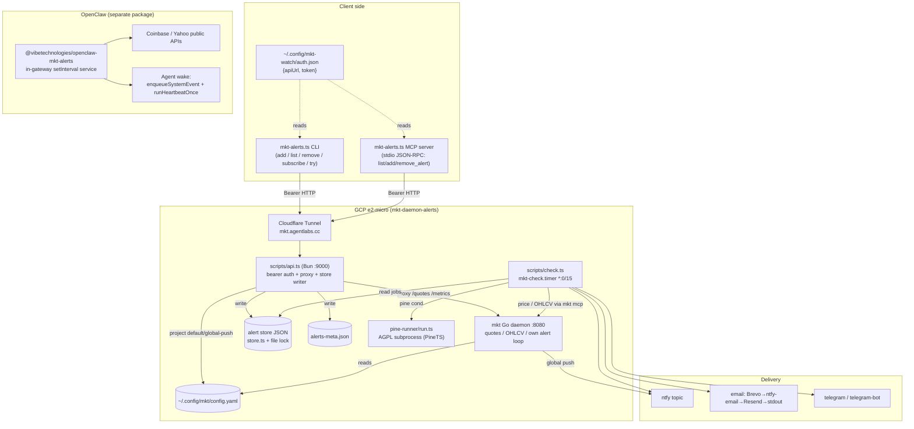

# mkt-alerts — Technical Design Document

Status: grounded in the current implementation (source read: `mkt-alerts.ts`, `scripts/api.ts`, `scripts/check.ts`, `scripts/store.ts`, `pine-runner/run.ts`, `integrations/openclaw/index.ts` + README, `deploy.sh`, `package.json`).

mkt-alerts is the **alerting / delivery / auth layer** wrapped around a third-party price engine — the `mkt` Go binary from [github.com/stxkxs/mkt](https://github.com/stxkxs/mkt). mkt-alerts owns everything the price engine does not: authenticated remote API, an alert model with evidence gates, a checker that evaluates conditions and delivers to multiple channels, an isolated Pine Script runner, an MCP server for AI agents, and an alternate in-gateway integration for OpenClaw.

---

## 1. Architecture overview

### 1.1 Layers

| Layer | File(s) | Runtime | Responsibility |
|---|---|---|---|
| Client / MCP / demo | `mkt-alerts.ts` (766 lines) | Node or Bun (published as Node CLI) | Hand-rolled CLI, stdio MCP server, zero-signup `try` demo. Talks HTTP (bearer) to the API. |
| API proxy | `scripts/api.ts` | Bun HTTP server on `:9000` | Bearer-auth gate in front of `mkt`. Routes quotes/metrics through; owns the alert store + meta. |
| Checker | `scripts/check.ts` | Bun, run by a systemd timer every ~15 min | Evaluates each alert, spawns pine-runner for Pine, delivers over channels, marks fired. |
| Pine sidecar | `pine-runner/run.ts` | Bun subprocess (AGPL, isolated) | Runs Pine Script v5 via PineTS against candles; returns signal/cross flags as one JSON line. |
| Store | `scripts/store.ts` | shared module (api + checker) | The alert-job store with an atomic cross-process file lock. |
| Price engine | `mkt` (external Go binary) | systemd `mkt-daemon` on `:8080` | Quotes, OHLCV history, its own alert polling + one global ntfy push. |
| OpenClaw integration | `integrations/openclaw/` | in-gateway service (`registerService` + `setInterval`) | Separate npm package. Fetches Coinbase/Yahoo directly, wakes the agent instead of pushing. |

### 1.2 How they compose

- The CLI and the MCP server are two front-ends onto the **same** HTTP API. Neither talks to `mkt` directly (except the `try` demo, which downloads its own `mkt` and runs fully local, never touching auth).
- `api.ts` is the only component that writes the alert store. It fronts `mkt` on loopback and adds bearer auth, an alert model, and the multi-channel checker store.
- `check.ts` is the delivery engine `mkt` isn't wired for here: it reads the store, pulls prices via `mkt mcp`, evaluates, and delivers to email/telegram/arbitrary ntfy topics.
- The Go `mkt` daemon runs its **own** alert loop for default/global-push alerts (see the dual-engine note below). Non-default routes are handled by `check.ts` only.
- The OpenClaw plugin is an **independent path**: it re-implements the pure evaluator, uses public price endpoints, and delivers by waking an agent rather than sending a notification.

### 1.3 Dual delivery engines (important)

Two engines can fire the same alert, so `api.ts` routes each alert to exactly one to avoid double-notify:

- **Go `mkt` daemon** — fires every rule in `config.yaml`, delivers a phone push to its **one** global ntfy topic. No per-alert email/telegram/other-topic routing.
- **Bun checker (`check.ts`)** — reads the store, can deliver email/telegram/any ntfy topic, and is the **only** engine that can run Pine.

`api.ts` decides projection at write time (`daemonShouldProject`, `checkerChannels`): default (no channels) or explicit `ntfy:<globalTopic>` → daemon config; everything else (email/telegram/non-global ntfy/pine) → checker store only.

### 1.4 Component architecture (mermaid)



---

## 2. Data / alert model

### 2.1 AlertJob (checker store shape)

From `scripts/store.ts` (`export type AlertJob`):

| Field | Type | Notes |
|---|---|---|
| `id` | `string` | Slug id (`symbol-conditions-value-<rand>`), or caller-supplied so meta + checker job share one id. |
| `desk` | `"crypto" \| "stocks" \| string` | Routing hint. |
| `symbol` | `string` | Upper-cased on store. |
| `match` | `"all" \| "any" \| "sequence"` | Optional; default `all`. `sequence` currently treated as `all`. |
| `conditions` | `Cond[]` | See below. Non-empty required. |
| `reasoning` | `string` | Required, non-empty. The thesis. |
| `channel` | `string` | Legacy comma-joined single spec. |
| `channels` | `string[]` | Newer array form. Both read via `resolveChannelSpec`. |
| `created` | `string` | ISO timestamp. |
| `expiry` | `string?` | ISO; alert stops evaluating after this. |
| `cooldownSec` | `number?` | Re-arm after N seconds; omit = one-shot. |
| `lastFired` | `string?` | ISO of last fire (cooldown bookkeeping). |
| `fired` | `boolean?` | One-shot done flag. |
| `analysisLink` | `string?` | URL shown in the notification. |

`Cond` (`store.ts`):

| Field | Type | Notes |
|---|---|---|
| `condition` | `string` | One of `VALID_CONDITIONS`. |
| `value` | `number` | Threshold (0 for pine). |
| `period` | `number?` | RSI/SMA period. |
| `script` | `string?` | Pine source (condition `pine` only). |
| `signalPlot` | `string?` | Pine plot carrying the signal (default `signal`). |
| `fireOn` | `"cross_up" \| "truthy"` | Pine fire semantics. |

`VALID_CONDITIONS`: `above, below, pct_up, pct_down, rsi_above, rsi_below, sma_cross_above, sma_cross_below, macd_cross, volume_above, stddev_above, pine`.

### 2.2 API meta shape

`api.ts` keeps a parallel `AlertMeta` (`id, symbol, conditions, match?, reason, analysisLink?, desk?, channels?, createdAt, enabled`). The CLI sends `reasoning`; the API accepts `reason` **or** `reasoning` and echoes both back so the CLI's REASON column is never blank.

### 2.3 Persistence

- **Checker store** — JSON array of `AlertJob`. Path: `MKT_ALERTS_STORE` env override (prod: `~/.config/mkt-watch/agent-alerts.json`), else repo `.cache/mkt/agent-alerts.json`. Resolved at call time, not module load.
- **Meta store** — `META_PATH` (default `~/.config/mkt-watch/alerts-meta.json`), atomic temp+rename write.
- **Daemon config** — `~/.config/mkt/config.yaml`, only for projected (global-push) alerts.
- **Atomic cross-process lock** (`store.ts`): every mutating read-modify-write runs under `withLock`. The lock is a file created with the exclusive `wx` flag, stamped with `{pid, ts}`. Stale locks (age > `MKT_LOCK_STALE_MS` or dead pid) are cleared atomically via rename-then-unlink so two contenders can't both steal it. `loadJobs` throws (never returns `[]`) on corrupt JSON, so a bad store can't silently overwrite all alerts. `saveJobs` writes a per-pid temp file then `rename(2)` (atomic on POSIX).

The OpenClaw plugin uses a **different, simpler** persistence: `fire-state.json` in the plugin `stateDir` (temp+rename, no cross-process lock — single-service owner).

---

## 3. Auth design

- Bearer token in `~/.config/mkt-watch/auth.json`: `{ apiUrl, token }`, written by `deploy.sh`, `chmod 600`.
- Every CLI/MCP request sends `Authorization: Bearer <token>` (`api()` / `apiRaw()` in `mkt-alerts.ts`).
- Server side (`api.ts`): `authorized()` compares the header to `Bearer ${API_TOKEN}`; any mismatch → `401 {"error":"unauthorized"}` before routing.
- Token minted at deploy with `openssl rand -hex 32`, reused on redeploy if `auth.json` already exists. Stored **only** in `auth.json` (user secret), not Bitwarden.
- `mkt` on loopback has no auth; `api.ts` strips the `Authorization` header before proxying upstream.
- **Data-source evidence gate**: for price-level conditions (`above`/`below`), both the CLI (`add`) and MCP (`add_alert`) require a data source, else `die()` / thrown error. The evidence is folded into the reasoning as `[data: ...]`. Indicator/pine conditions are exempt. Rationale: prevent fabricated support/resistance levels.
- MCP lazy auth: `initialize` and `tools/list` work with no `auth.json`; `tryLoadAuth` is called only inside a tool handler, and failures become JSON-RPC/tool errors (never `die()`, which would kill the long-lived server).

---

## 4. Delivery subsystem

Channel dispatch lives in `check.ts` (`notify` → `notifyOne`). A job's channels come from `resolveChannelSpec` (comma-joined). Each channel is a `prefix:target` token:

| Channel spec | Transport |
|---|---|
| `stdout` | `console.log(msg.text)`. |
| `ntfy:<topic>` | POST to `NTFY_SERVER` (default `ntfy.sh`) `/topic`, `Title` = ASCII-stripped subject, optional bearer `NTFY_TOKEN`. |
| `telegram:<target>` | Shells `python3 ~/.agents/skills/telegram-cli/telegram-cli.py send <target> <text>` (Telethon session). |
| `telegram-bot:<chatId>` | Bot API `sendMessage` with `TELEGRAM_BOT_TOKEN`; falls back to stdout if unset. |
| `email:<addr>` | `deliverEmail` — layered fallback chain. |

**Email fallback chain** (`deliverEmail`): Brevo (`BREVO_API_KEY` + verified `ALERT_EMAIL_FROM`) → ntfy-native email (`Email:` header on the topic, needs `NTFY_TOKEN`) → Resend (`RESEND_API_KEY` + `ALERT_EMAIL_FROM`) → stdout. First 2xx wins; a non-ok status or thrown error falls through. stdout is the final guarantee so an alert is never silently dropped. An unverified/missing `ALERT_EMAIL_FROM` skips Brevo/Resend (ESP would reject), but ntfy-email still runs.

**HTTP header hygiene**: ntfy carries the subject in the latin-1 `Title` header; `asciiHeader` strips emoji/unicode so Bun's `fetch` doesn't throw on the 🔔 prefix.

**Message shape** (`buildAlertMessage`): `subject` (symbol + trigger), `body` (multi-line: trigger, current price, why, analysis link, provenance footer) for email; `text` (compact single-string) for push channels.

**Silent-failure risk (by design, worth noting)**: `notify` catches per-channel errors and logs but continues; after `notify` returns, the job is marked fired unconditionally. For the Bot API and telegram-cli paths the response status isn't checked, so any "sent" (or a swallowed error) marks the alert fired. A recipient could miss a delivery while the alert is recorded as fired.

---

## 5. Pine execution design

- **License isolation**: PineTS is AGPL-3.0. The MIT core must never import it. So Pine runs in `pine-runner/run.ts`, its **own package** (own `node_modules`, own AGPL license), deployed as a sibling of `scripts/` and **spawned as a subprocess** — never imported. This keeps the published MIT CLI clean.
- **Contract** (stdin→stdout, one JSON line):
  - stdin: `{ script, candles: Candle[], signalPlot? }`
  - stdout ok: `{ ok:true, signalPlot, bars, last, prev, truthy, crossedUp, crossedDown, plots }`
  - stdout err: `{ ok:false, error, available? }`
  - The Pine script must `plot(series, "signal")` (or the chosen `signalPlot` name) to expose the fire series.
- **Semantics**: from `last`/`prev` of the plot data — `truthy = last > 0` (state), `crossedUp = prev<=0 && last>0` (edge), `crossedDown = prev>0 && last<=0`. The checker chooses `truthy` vs `crossedUp` from the condition's `fireOn` (default `cross_up`).
- **Where evaluated**: on the **checker** (`check.ts` → `runPineSignal`), not the client, and **not** TradingView. The checker fetches full OHLCV via `mkt mcp query_history`, spawns `bun pine-runner/run.ts`, and reads the last JSON line. Pine signals are pre-computed and passed into the pure `evalCond` via `data.pineSignals` keyed by cond identity, so `evalCond` stays pure.
- A pine alert is **always** checker-managed (the Go daemon can't run Pine), so `api.ts` never projects it to `config.yaml` and always mirrors it to the checker store (falling back to the global ntfy topic if no explicit channel).

### 5.1 Set alert → checker fires → deliver / wake (mermaid sequence)

```mermaid
sequenceDiagram
  participant Agent as AI agent / user
  participant CLI as CLI or MCP (mkt-alerts.ts)
  participant API as api.ts (:9000)
  participant Store as store.ts (locked JSON)
  participant Timer as mkt-check.timer
  participant Check as check.ts
  participant Mkt as mkt daemon (:8080)
  participant Pine as pine-runner
  participant Out as ntfy / email / telegram
  participant OC as OpenClaw plugin

  Agent->>CLI: add_alert (symbol, conditions, data_source, channels)
  CLI->>CLI: enforce data-source gate on above/below
  CLI->>API: POST /alerts (Bearer)
  API->>API: authorize; validate conditions/channels
  API->>Store: addJob (mirror; pine or non-global routes)
  API->>API: write meta; project to config.yaml only if global-push
  API-->>CLI: 201 AlertMeta (+reasoning)

  Note over Timer,Check: every 15 min (OnCalendar=*:0/15)
  Timer->>Check: run check.ts
  Check->>Store: loadJobs (skip fired/expired/cooldown)
  Check->>Mkt: mkt mcp get_quote / query_history
  Mkt-->>Check: price / OHLCV
  alt has pine condition
    Check->>Pine: spawn {script, candles, signalPlot}
    Pine-->>Check: {truthy, crossedUp, crossedDown}
  end
  Check->>Check: evaluateJob (all/any) → fires?
  alt fires
    Check->>Out: notify each channel (email fallback chain)
    Check->>Store: markFired (lock)
  else no fire
    Check-->>Check: log no-fire
  end

  Note over OC: independent path (in-gateway)
  OC->>OC: setInterval tick → fetch Coinbase/Yahoo
  OC->>OC: evaluateJob → fires?
  OC->>OC: enqueueSystemEvent + runHeartbeatOnce (wake agent)
```

---

## 6. Deployment / infra

`deploy.sh` (idempotent, run locally; drives GCP + Cloudflare + SSH):

| Item | Value |
|---|---|
| GCP project | `mkt-daemon-alerts` |
| GCP config | `bisonte` |
| Zone | `us-central1-a` |
| VM | `mkt-daemon`, `e2-micro`, Debian 12, 20 GB |
| Public entry | Cloudflare Tunnel → `mkt.agentlabs.cc` (CNAME to `<tunnel>.cfargotunnel.com`, proxied) |
| Ingress | tunnel → `http://127.0.0.1:9000` (mkt-api), **not** mkt directly |
| mkt daemon | `mkt daemon --listen 127.0.0.1:8080`, systemd `mkt-daemon.service`, `Restart=always` |
| API | `bun api.ts` on `:9000`, systemd `mkt-api.service` |
| Checker | `mkt-check.service` + `mkt-check.timer`, `OnCalendar=*:0/15`, `Persistent=true` |
| Dividend watcher | `dividend-watch.timer`, daily 21:15 (separate job) |
| pine-runner | deployed separately as a sibling dir with its own `bun install` |

Flow: `Cloudflare Tunnel → mkt-api :9000 → mkt daemon :8080`.

- The `mkt` binary is built on the VM from source at pinned commit `MKT_COMMIT=0207dda` (`go build`).
- Secrets: pulled from Bitwarden **on the deploy host**, written to a temp env file, SCP'd, and installed to `/etc/mkt-daemon.env` (`mode 600`), then the local temp is shredded. `/etc/mkt-daemon.env` carries delivery provider keys (`TELEGRAM_BOT_TOKEN`, `NTFY_TOPIC`, `NTFY_TOKEN`, `ALERT_EMAIL`, `ALERT_EMAIL_FROM`, `BREVO_API_KEY`, `API_TOKEN`, `MKT_ORIGIN`, `PORT`). Note: the running **daemon** does not read Bitwarden — secrets are baked in at deploy time.
- The API token itself is **not** in Bitwarden — it lives only in `~/.config/mkt-watch/auth.json` on the client and in `/etc/mkt-daemon.env` on the VM.
- `mkt-api.service` is explicitly `restart`ed on deploy (not just `enable --now`) — otherwise a running unit keeps serving the old `api.ts`, which previously stranded alerts as meta-only (never mirrored to the checker store).
- `restartMkt()` only SIGTERMs `mkt` when it detects the `mkt-daemon` systemd unit is active (`systemctl is-active --quiet`), so a local dev box without systemd doesn't kill an unmanaged `mkt`.

---

## 7. Distribution / install

### 7.1 npm packages

| Package | Purpose | bin / entry |
|---|---|---|
| `@vibetechnologies/mkt-alerts` | CLI + MCP + `try` | `bin: mkt-alerts → ./dist/mkt-alerts.js`; build via `bun run build` (`bun build ... --target node`). `package.json` version `1.1.0`. |
| `@vibetechnologies/openclaw-mkt-alerts` | OpenClaw agent-wake plugin | `integrations/openclaw/` (`definePluginEntry`, service `mkt-alerts-checker`). |

### 7.2 Honest publish state

- npm registry currently at **1.0.2** (a stripped build). **1.1.0** and the plugin publish are **pending a write token**.
- The working **no-clone** path today is: `npx -y github:dzianisv/mkt-alerts`.
- OpenClaw no-clone install target (once published): `openclaw plugins install @vibetechnologies/openclaw-mkt-alerts`. OpenClaw only accepts a **local path**, an **npm-registry spec**, **ClawHub**, or a **marketplace repo** — it rejects raw github/tarball URLs. So npm publish is the enabler for the clean install.
- From a clone: `openclaw plugins install ./integrations/openclaw && openclaw gateway restart` works today.

### 7.3 The `try` demo (zero-signup)

`mkt-alerts try` downloads the `mkt` release binary (`MKT_VERSION=0.1.0`) to `~/.cache/mkt-alerts`, seeds a watchlist, runs a local daemon on `127.0.0.1:<free port>`, polls a live `BTC-USD` quote, and fires a demo `above` alert. Node-safe, never touches `auth.json`, nothing persists.

---

## 8. Known limitations / tech debt

- `volume_above` and `stddev_above` are **hardcoded `false`** stubs in both `check.ts` and the OpenClaw plugin (volume not in the data path; stddev not computed).
- `match: "sequence"` is evaluated identically to `"all"` — proper ordering needs cross-run state (both engines).
- RSI(14)/SMA(20) periods default in the evaluator; the `period` field exists on `Cond` and is honored by the checker, but the **CLI has no `--period` flag**, so from the CLI they are effectively fixed.
- Email delivery has a **silent-failure surface**: per-channel errors are caught and logged, and the job is marked fired regardless; some transports (telegram-bot, telegram-cli) don't check delivery status.
- The hosted instance is **single-tenant** — one global ntfy topic, one API token, one VM. No per-user isolation.
- MCP `add`/`remove` require `auth.json` to exist **at call time** (lazy, but still required for any tool call).
- OpenClaw plugin **defers**: Pine (`condition: pine` never fires), `match: "sequence"` (= all), `volume_above`/`stddev_above`, and `alertsFile` write-back/locking (read-only, no cross-process lock).
- Price parsing in `check.ts` is regex-based on `mkt mcp` text output (`$([0-9,.]+)`, `C=([0-9.]+)`), which couples the checker to `mkt`'s human-readable format.

---

## 9. Diagram index

- Component architecture: section 1.4.
- Set alert → checker fires → deliver/wake sequence: section 5.1.
